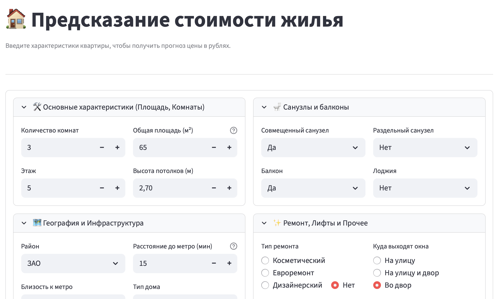
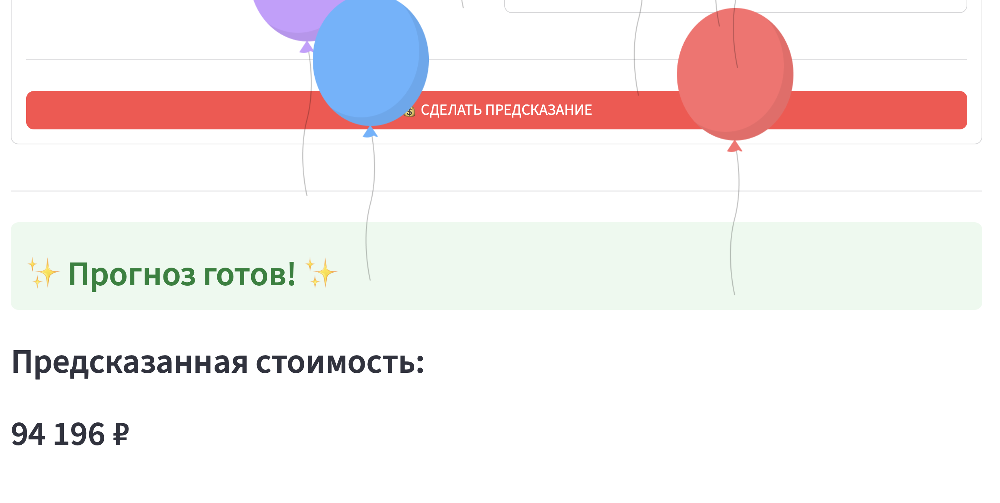

📌 **AI REA Ltd — Apartment Rental Price Prediction**
**How Much Is The…?**

Проект команды: "Team A" 💣

📖 **О проекте**
Этот проект выполняется в рамках работы отдела аналитики и оптимизации международного сервиса аренды и продажи недвижимости AI REA Ltd (Alyona Ivanovna Real Estate Agency).

*Цель проекта* — подготовить качественный обучающий датасет, который позволит разработчикам ML обучить модель, точно предсказывающую стоимость аренды квартир в Москве. Модель должна улучшить текущую метрику MAPE с ≈50% до 30% и ниже, что критически важно для бизнеса.

🎯 **Основная задача**
Наша команда отвечает за полный цикл подготовки данных, включающий:
1. Разведочный анализ данных (EDA)
2. Очистку данных и устранение пропусков
3. Создание дополнительных признаков - Feature engineering
4. Подготовку итогового датасета для обучения ML

Работа выполняется в несколько релизов.

🚀 **Релизы проекта**. 

🔵 Релиз 1.0 — Exploratory Data Analysis (EDA)

*Цель:* понять структуру данных от Alyona Ivanovna Real Estate Agency, подготовить данные для разработчиков машинного обучения, а именно выявить проблемы в датасете.

🧩 Состав репозитория на этом этапе:  

    ➡️ README.md — описание проекта. 

    ➡️ https://real-estate-app-eda-qy9kxvbwgqzbkkklvseask.streamlit.app/ — визуальный отчёт с графиками и текстовыми выводами. 

    ➡️ EDA.ipynb — ноутбук, в котором проводился разведочный анализ. 

Что было сделано❓:  

  ✅ Загружены данные, полученные от дата-инженеров. 

  ✅ Изучены распределения основных переменных
  ✅ Проведён анализ корреляций. 

  ✅ Построены графики (распределения площади, цены, комнатности, метрополитена и др.). 

  ✅ Сформированы первоначальные гипотезы о факторах, влияющих на стоимость аренды. 

  ✅ Удаление нерелевантных колонок. 

🟢 Релиз 2.0 — Предобработка и очистка данных. 

*Цель:* подготовить “чистую” таблицу без пропусков и аномалий.  

🧩 Добавляется в репозиторий:  

  ➡️ preprocessing.ipynb — ноутбук с полным пайплайном обработки. 

  ➡️ data.csv — очищенная таблица:  

     - названия колонок только на английском языке. 

     - отсутствуют пропуски (NaN, None и т.п.). 

Что было сделано❓:  

  ✅ Переименованы колонки на английский язык. 

  ✅ Обработаны пропуски:  

     - заполнение медианами/модами, заполнение информации из описания. 

     - извлечение признаков из текстовых полей. 

  ✅ Очищены артефакты парсинга. 

  ✅ Приведены типы данных. 

🟣 Релиз 3.0 — Feature Engineering и итоговый датасет

*Цель:* расширить данные новыми полезными признаками и подготовить финальный датасет для ML.

Что было сделано❓:  

  ✅ Подготовлен итоговый файл с новыми фичами - team_A_data.csv. 

  ✅ Обновлен preprocessing.ipynb:  

      - Удалены выбросы. 

      - Закодированы строковые признаки. 

      - Все значения только числовые (int/float). 

      - Уникальные объявления (удалены дубликаты). 

      - Cохранена колонка id. 

  ✅ Обновлен README.md. 

  ✅ Добавлен файл machine_learning.ipynb, который содержит:  

      - Нормализацию строковых категорий. 

      - Создана и обучена модель. 

  
🗂️ Файл streamlit_app содержит локальное веб-приложение, позволяющее предсказывать стоимость аренды квартир в Москве по её параметрам. 

Пример работы веб-приложения 📲
. 

. 

. 

👥 **Команда проекта:**. 

Участник 1 - Никовский Игорь. 

Участник 2 - Павлов Дмитрий. 

Участник 3 - Бахарева Виолетта. 
